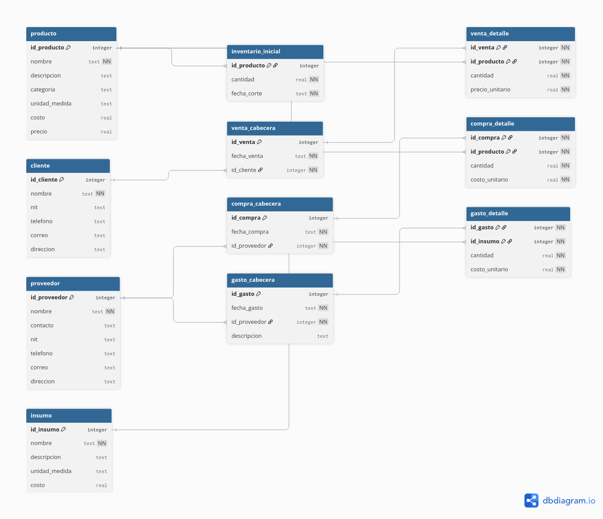

# GuateCompost ERP

Sistema de gestión empresarial (ERP) para distribuidora de productos de compostaje.
Desarrollado como proyecto freelance por Edwin Lee Tiño.

---

## Descripción

GuateCompost ERP es una solución de gestión diseñada para pequeñas empresas
distribuidoras. Centraliza el control de ventas, compras, inventario y gastos
operativos, y expone la información mediante dashboards en Looker Studio para
soporte a la toma de decisiones empresariales.

El sistema está construido con herramientas livianas y de código abierto,
lo que lo hace replicable para otros clientes (incluso de segmentos distintos al de compostaje).

---

## Objetivos del proyecto

- Reemplazar el control manual en Excel por un sistema estructurado.
- Proveer información confiable y oportuna para la toma de decisiones.
- Diseñar una arquitectura reutilizable para otros clientes distribuidores.

---

## Stack tecnológico

| Capa | Herramienta |
|---|---|
| Base de datos | SQLite3 |
| Backend / ERP | Python 3 |
| Interfaz de usuario | Streamlit |
| Reportería y BI | Looker Studio |
| Control de versiones | Git / GitHub |
| Documentación | Markdown / dbdiagram.io |

---

## Modelo de datos

El sistema se compone de 11 tablas organizadas en tres cadenas:

**Cadena comercial:** producto, cliente, proveedor,
venta_cabecera, venta_detalle, compra_cabecera, compra_detalle

**Inventario:** inventario_inicial

**Gastos operativos:** insumo, gasto_cabecera, gasto_detalle



---

## Estructura del proyecto

```
guatecompost/
├── docs/
│   ├── erd.png
│   └── bitacora.md
├── data/
│   └── guatecompost.db
├── app/
└── reports/